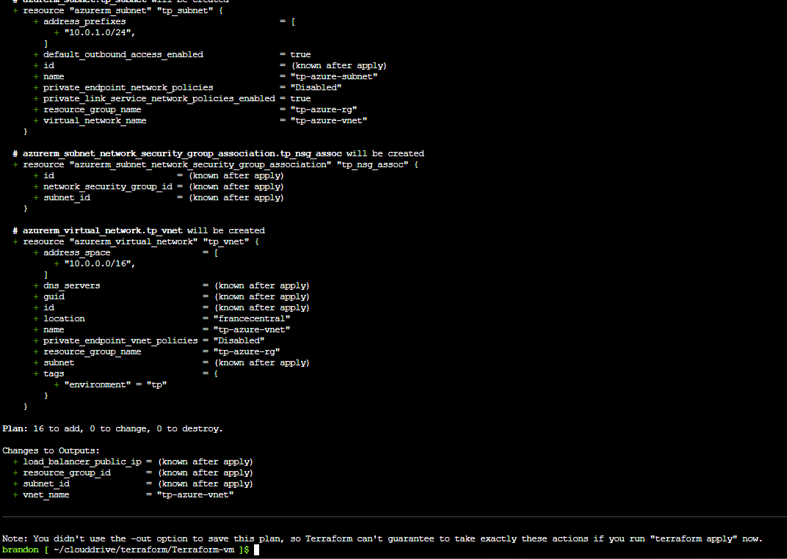
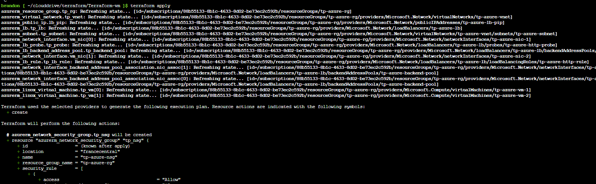
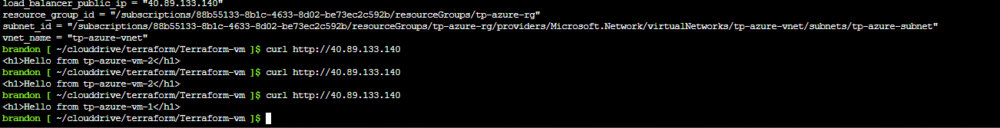
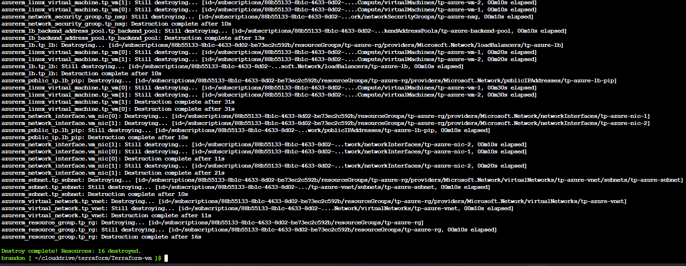

# Commandes Terraform essentielles

---

## 1. `terraform plan`

La commande `plan` permet de **prévisualiser les changements** que Terraform va appliquer sur l'infrastructure, sans rien modifier réellement. C'est une étape de vérification indispensable avant tout déploiement.

```bash
terraform plan
```

> Terraform compare l'état actuel de l'infrastructure avec le code `.tf` et affiche ce qui sera **créé**, **modifié** ou **détruit**.



---

## 2. `terraform apply`

La commande `apply` **applique les changements** définis dans le code Terraform. Terraform affiche d'abord un résumé (comme un `plan`) puis demande une confirmation avant d'agir.

```bash
terraform apply
```

Pour éviter la confirmation manuelle (utile en CI/CD) :

```bash
terraform apply -auto-approve
```



---

## 3. Vérification avec `curl`

Une fois les VMs ou services déployés, on peut utiliser `curl` pour **vérifier qu'un endpoint est accessible** (par exemple une API ou un serveur web).

```bash
curl http://<adresse-ip-de-la-vm>
```

Avec plus de détails sur la réponse HTTP :

```bash
curl -v http://<adresse-ip-de-la-vm>
```

Pour tester un port spécifique :

```bash
curl http://<adresse-ip-de-la-vm>:<port>
```



---

## 4. `terraform destroy`

La commande `destroy` **supprime toutes les ressources** créées par Terraform. À utiliser avec précaution, car l'action est irréversible.

```bash
terraform destroy
```

Pour éviter la confirmation manuelle :

```bash
terraform destroy -auto-approve
```

> ⚠️ Cette commande supprime **toutes** les ressources du projet : VMs, réseaux, sous-réseaux, interfaces réseau, etc.



---

## Récapitulatif

| Commande | Rôle |
|---|---|
| `terraform plan` | Prévisualise les changements sans les appliquer |
| `terraform apply` | Applique les changements et déploie l'infrastructure |
| `curl http://<ip>` | Vérifie qu'un service est accessible après déploiement |
| `terraform destroy` | Supprime toutes les ressources créées par Terraform |

---

## Difficultés rencontrées

### Doublon de `required_providers`

Lors du `terraform init`, l'erreur suivante est apparue :

```
Error: Duplicate required providers configuration
A module may have only one required providers configuration.
The required providers were previously configured at providers.tf:2,3-21.
```

**Cause** : le bloc `required_providers` était déclaré dans deux fichiers différents (`providers.tf` et `versions.tf`). Terraform fusionne tous les fichiers `.tf` d'un même dossier, ce qui créait un conflit.

**Solution** : supprimer le bloc `terraform {}` en double et ne le conserver que dans un seul fichier, ici `providers.tf`.

```hcl
# providers.tf - un seul bloc terraform autorisé
terraform {
  required_version = ">= 1.5.0"
  required_providers {
    azurerm = {
      source  = "hashicorp/azurerm"
      version = "~> 4.28.0"
    }
  }
}
```


---

### Mauvaise région Azure : `eastus` → `francecentral`

**Cause** : la variable `location` était initialement définie sur `"eastus"`, une région américaine, ce qui pouvait poser des problèmes de disponibilité ou de conformité selon le contexte.

**Solution** : modifier la valeur dans `variables.tf` ou `terraform.tfvars` pour utiliser la région française :

```hcl
# variables.tf
variable "location" {
  type        = string
  description = "Région Azure où déployer les ressources"
  default     = "francecentral"
}
```

Ou directement dans `terraform.tfvars` :

```hcl
location = "francecentral"
```

